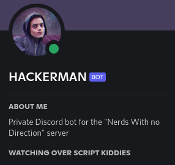
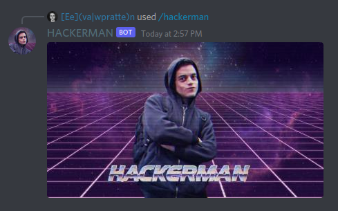

# HACKERMAN
[](https://github.com/nwnd/hackerman/actions/workflows/build.yml)
[](https://github.com/nwnd/hackerman/actions/workflows/clippy.yml)
[](https://github.com/nwnd/hackerman/actions/workflows/audit.yml)
[](https://github.com/nwnd/hackerman/actions/workflows/docker_img.yml)

***HACKERMAN*** is a Discord bot powered by the [Serenity](https://github.com/serenity-rs/serenity) bot framework, written in Rust.

The goal of this bot is to provide a collection of funny memes and useful commands for our private Discord server, along with a few commands for DMs.





## Building and running

No matter how you run the bot, you must set both the `DISCORD_TOKEN` and `DISCORD_APP_ID` environment variables.

### Running in debug mode

```sh
DISCORD_TOKEN=<token> DISCORD_APP_ID=<app_id> RUST_LOG=info cargo run -- ./cmdmap.json
```

### Running in release mode

```sh
DISCORD_TOKEN=<token> DISCORD_APP_ID=<app_id> RUST_LOG=info cargo run --release -- ./cmdmap.json
```

### Running in Docker

```sh
docker build -t hackerman .
docker run -it --rm -e DISCORD_TOKEN=<token> -e DISCORD_APP_ID=<app_id> hackerman
```